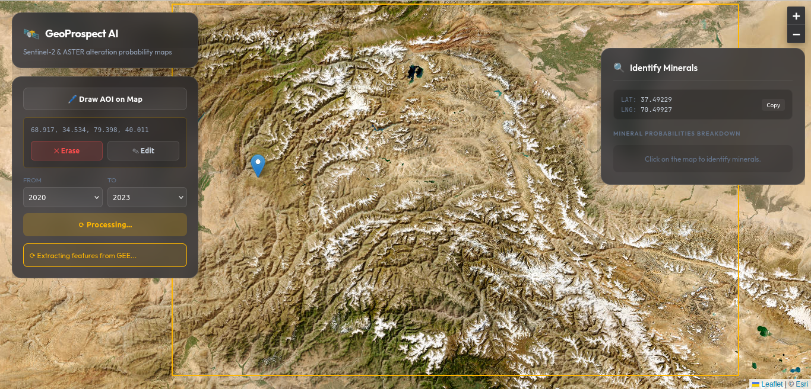
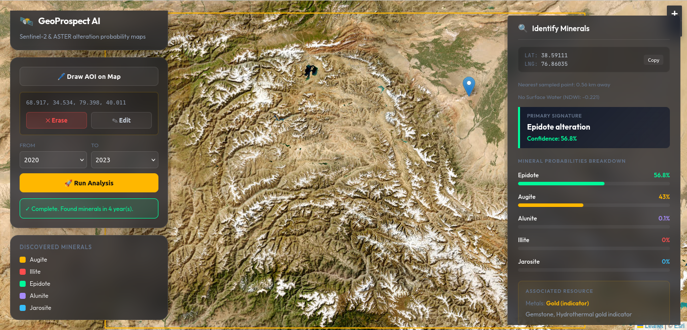

# GeoProspect AI — Mineral Detection from Satellite Imagery

GeoProspect AI is a full-stack system that detects minerals at any
user-defined location on Earth using satellite imagery (Sentinel-2 and
ASTER), unsupervised spectral clustering, and a trained XGBoost model.
A user draws a region on a map, the system pulls satellite data for that
region from Google Earth Engine, figures out what minerals are spectrally
present, trains/uses a model to classify them, and shows the results in
the browser — including clicking individual points on the map to see
mineral probabilities, associated metals, and everyday uses.

---

## 1. High-Level Concept

```
User draws AOI (Area of Interest) on map
        ↓
Backend pulls satellite data for that AOI from Google Earth Engine
        ↓
Pixels are clustered by spectral similarity (HDBSCAN)
        ↓
Each cluster is matched to a known mineral spectrum (Spectral Angle Mapper)
        ↓
XGBoost model is trained (or a pre-trained global model is reused)
        ↓
Model predicts mineral probabilities for the AOI
        ↓
Results shown in browser — overall AOI summary + click-to-inspect points
```

The system does **not** rely on pre-existing geological maps. It derives
mineral labels directly from satellite spectral signatures, compares them
to a reference library of real mineral spectra (USGS spectral library),
and uses that as training data for a machine learning model.

---
## 2. Application Preview 





---

## 3. Folder and File Structure

```
MineralDetection/
│
├── backend/
│   ├── main.py                     # FastAPI server — API endpoints
│   └── requirements.txt            # Backend Python dependencies
│
├── frontend/
│   ├── src/
│   │   └── MapViewer.jsx           # Main UI — map, AOI drawing, results panel
│   ├── package.json
│   └── vite.config.js
│
├── data/
│   └── {job_id}/                   # One folder per analysis job
│       ├── features_{job_id}_{year}.csv   # Raw satellite pixel samples
│       ├── labels_{job_id}_{year}.csv     # Pixels + assigned mineral labels
│       ├── training_dataset.csv           # Combined labelled data for this job
│       ├── mineral_model.pkl              # Trained XGBoost model (per-job)
│       ├── mineral_encoder.pkl            # Label encoder (per-job)
│       ├── result_{year}.json             # Final mineral summary per year
│       └── job_summary.json               # Full job result (all years)
│
├── splib07/                        # USGS Spectral Library (downloaded separately)
│   └── ASCIIdata/
│       └── ASCIIdata_splib07b_rsSentinel2/ChapterM_Minerals/  # Used spectra
│       └── ASCIIdata_splib07b_rsASTER/ChapterM_Minerals/
│
├── credentials/
│   └── drive_service_account.json  # Google Drive API credentials (you provide)
│
├── extract_features.py             # Step 1 — pulls satellite data from GEE
├── multiclass_label_generation.py  # Step 2 — clusters pixels, assigns mineral labels
├── sample_rasters.py                # Step 3 — merges yearly labels into training set
├── train_model.py                   # Step 4 — trains per-job XGBoost model
├── train_global_model.py            # Trains a single global model from all jobs
├── build_global_dataset.py          # Merges all jobs' training data into one file
├── predict_map.py                   # Step 5 — generates predictions + point lookups
├── pipeline.py                       # Orchestrates Steps 1–5 in order
├── mineral_associations.py          # Lookup table: mineral → metals/everyday uses
├── build_spectral_library.py        # Builds reference spectra from splib07
├── build_spectral_library_manual.py # Fallback — hardcoded reference spectra
│
├── usgs_spectral_references.csv     # Reference spectra used for SAM matching
├── global_training_dataset.csv       # All jobs' labelled data combined
├── global_mineral_model.pkl          # Pre-trained model used for new jobs
├── global_mineral_encoder.pkl        # Label encoder for the global model
└── requirements.txt                   # Root Python dependencies
```

---

## 4. Where the Data Comes From

### 4.1 Satellite Imagery — Google Earth Engine (GEE)

Two satellite sources are used, both accessed through the
`earthengine-api` Python library:

- **Sentinel-2 SR (Surface Reflectance)** — bands B2, B3, B4, B8, B11, B12
  (blue, green, red, near-infrared, two shortwave-infrared bands).
  Collection: `COPERNICUS/S2_SR_HARMONIZED` (or `COPERNICUS/S2` for years
  before 2017).
- **ASTER** — bands B01, B02, B3N (visible and near-infrared only; ASTER's
  shortwave-infrared sensor failed permanently in 2008, so those bands are
  not used).
  Collection: `ASTER/AST_L1T_003`.

For a given AOI (bounding box) and year, both collections are filtered,
cloud-filtered (Sentinel-2 only, <30% cloud cover), and reduced to a
median composite — effectively "what does this area typically look like
in this year, with clouds removed."

### 4.2 Derived Spectral Indices

From the raw bands, six derived indices are computed — these are the
actual signals used for mineral detection, since raw reflectance alone is
noisy:

| Index | Formula | What it indicates |
|---|---|---|
| Iron_Oxide | B4 / B2 | Presence of iron oxide minerals (hematite, goethite, jarosite) |
| Clay_Index | B11 / B12 | Presence of clay/hydroxyl minerals |
| NDVI | (B8-B4)/(B8+B4) | Vegetation cover |
| NDWI | (B3-B8)/(B3+B8) | Water presence |
| Ferric_Iron | ASTER B02 / ASTER B01 | Ferric iron content |
| Silica_Index | ASTER B3N / ASTER B01 | Silica-rich minerals (quartz, feldspar) |

### 4.3 Reference Mineral Spectra — USGS Spectral Library (splib07)

The USGS splib07 library contains lab-measured reflectance spectra for
thousands of real mineral samples, pre-resampled to match Sentinel-2 and
ASTER band wavelengths. This project uses **30 minerals** from
`ChapterM_Minerals` (the "Minerals" chapter of the library), covering iron
oxides, clays, carbonates, sulfates, silicates, mafic minerals, and ore
minerals (pyrite, chalcopyrite, galena, sphalerite, etc).

`build_spectral_library.py` reads these files, averages multiple samples
per mineral, computes the same six derived indices for each reference
spectrum, and saves everything to `usgs_spectral_references.csv`. This
file is the "answer key" used to identify what mineral a cluster of
satellite pixels most likely represents.

If the USGS library is unavailable, `build_spectral_library_manual.py`
provides hardcoded approximate values for the same minerals as a fallback.

### 4.4 Why No Geological Maps Are Used

Early versions of this project considered using existing geological maps
(e.g. Macrostrat) as ground truth. This was dropped because:
- Map coverage is incomplete/low-resolution in many regions
- It would make mineral detection limited to mapped areas only
- The goal is to detect minerals **dynamically anywhere**, derived purely
  from what the satellite actually sees

---

## 5. The Processing Pipeline — Step by Step

All steps are orchestrated by `pipeline.py`, called via
`run_pipeline(job_id, bbox, year_start, year_end, generate_map)`.

### Step 1 — `extract_features.py`: Pull Satellite Data

For each year in the range:
1. Build the AOI as an `ee.Geometry.Rectangle(bbox)`.
2. Get Sentinel-2 and ASTER median composites for that year (with fallback
   to a zero-image if no ASTER scenes exist for that AOI/year).
3. Compute the six derived indices.
4. Use `feature_stack.sample(region=aoi, scale=60, numPixels=10000,
   tileScale=4, geometries=True)` to randomly sample ~10,000 pixels from
   the AOI, each with all 15 band/index values plus its lat/lon
   coordinate.
5. Export this sample as a CSV to Google Drive via
   `ee.batch.Export.table.toDrive(...)`.

`wait_for_tasks()` polls GEE until all export tasks complete.
`download_from_drive()` then uses the Google Drive API (with a service
account) to download each CSV into `data/{job_id}/`.

Settings like `scale=60` (60m pixel resolution) and `tileScale=4` (splits
computation into smaller tiles) exist specifically to avoid GEE's "user
memory limit exceeded" error on larger AOIs.

**Output:** `data/{job_id}/features_{job_id}_{year}.csv` — one row per
sampled pixel, columns include B2, B3, B4, B8, B11, B12 (Sentinel-2, scaled
×10000 as GEE returns them), B01/B02/B3N (ASTER), the six derived indices,
and `.geo` (a JSON string with the pixel's lon/lat).

### Step 2 — `multiclass_label_generation.py`: Discover Minerals via Clustering

This step has no prior knowledge of what minerals exist in the AOI — it
discovers them from the data:

1. **Normalize bands.** Sentinel-2 bands from GEE are scaled by 10000
   (reflectance × 10000); they're divided back down to the 0–1 range to
   match the USGS library's scale. Derived indices are recomputed after
   normalization so everything is on a consistent scale.

2. **Clean data.** Drop rows with infinities/NaNs in the feature columns.

3. **Cluster pixels with HDBSCAN.** Each pixel is a 10-dimensional point
   (Iron_Oxide, Clay_Index, NDVI, NDWI, Ferric_Iron, Silica_Index, B4, B8,
   B11, B12), standardized via `StandardScaler`. HDBSCAN groups pixels
   with similar spectral signatures into clusters; pixels that don't fit
   any cluster are marked as noise (-1) and discarded.
   - `min_cluster_size` and `min_samples` scale dynamically based on how
     many pixels are available (more pixels → larger minimum cluster
     size).
   - If HDBSCAN finds zero clusters, it retries with relaxed parameters,
     and if that also fails, falls back to KMeans (k=3) so a result is
     always produced.

4. **Match each cluster to a mineral via Spectral Angle Mapper (SAM).**
   For each cluster, compute the mean spectral signature (averaged across
   its pixels), then compute the "spectral angle" (a similarity measure
   based on vector direction, not magnitude) between that mean spectrum
   and every mineral's reference spectrum in
   `usgs_spectral_references.csv`. The mineral with the smallest angle
   (most similar shape) is assigned to that cluster — but only if the
   angle is below `sam_threshold` (currently 0.5 radians, ≈28.6°);
   otherwise the cluster is labelled "unclassified".

5. **Save labelled data.** Every pixel gets a `Mineral_Type` (the mineral
   assigned to its cluster, or "noise"/"unclassified"), plus a binary
   `label` column (1 if it has a real mineral assignment).

**Output:** `data/{job_id}/labels_{job_id}_{year}.csv` and a list of
mineral names discovered for that year (e.g. `['Jarosite', 'Siderite']`).

### Step 3 — `sample_rasters.py`: Build the Training Dataset

Simply merges all years' `labels_{job_id}_{year}.csv` files for this job
into one `training_dataset.csv`, dropping any rows labelled "noise" or
"unclassified" (these aren't useful for training — they represent pixels
that don't match any known mineral confidently).

### Step 4 — `train_model.py` / Global Model: Train or Reuse XGBoost

`pipeline.py` checks if `global_mineral_model.pkl` and
`global_mineral_encoder.pkl` exist in the project root:

- **If they exist:** they're copied into `data/{job_id}/` as
  `mineral_model.pkl` and `mineral_encoder.pkl` — no training happens.
  This is the normal path for production use, since training a global
  model from many regions produces a more robust, broadly-useful model.
- **If they don't exist:** `train_model.py`'s `train(data_dir)` function
  trains a fresh XGBoost model on just this job's `training_dataset.csv`.

**What `train()` does:**
1. Load `training_dataset.csv`, clean NaNs/infinities.
2. Require at least 2 mineral classes (raises an error otherwise — a
   spectrally uniform AOI can't train a multiclass model).
3. Encode mineral names to integers via `LabelEncoder`.
4. **Balance classes** — if one mineral massively dominates (e.g. 10,000
   Jarosite vs 8 Chromite pixels), the majority class is downsampled to at
   most 10× the smallest class's count. This prevents the model from
   trivially predicting the majority class for everything.
5. Split into train/test (by year if multiple years exist — train on
   earlier years, test on the latest year — otherwise a random 80/20
   split).
6. Train an `XGBClassifier` with `objective='multi:softprob'` (multiclass
   probability output).
7. Print accuracy, classification report, confusion matrix, and feature
   importances for diagnostics.
8. Save `mineral_model.pkl` and `mineral_encoder.pkl` to `data/{job_id}/`.

### Step 5 — `predict_map.py`: Generate Final Results

For each year:
1. Load the (job-specific or global) model and encoder.
2. Run `model.predict_proba()` on all sampled pixels for that year.
3. For each mineral class, compute:
   - `confidence` — the highest probability seen for that mineral across
     all pixels
   - `mean_prob` — average probability across all pixels
   - `coverage_pct` — percentage of pixels where that mineral's
     probability exceeds 50%
4. Enrich each mineral with associated metals/uses from
   `mineral_associations.py`.
5. Save as `data/{job_id}/result_{year}.json`.

If `generate_map=True`, an additional GeoTIFF probability map is generated
(one band per mineral, uint8-encoded 0–255, LZW-compressed). This is
optional and slow for large AOIs — see Section 7 for why point-based
lookup is preferred instead.

`predict_nearest_point(lat, lng, job_id, year, data_dir)` supports
clicking individual map locations: it finds the closest sampled pixel (by
lat/lon distance) in `features_{job_id}_{year}.csv`, runs it through the
model, and returns per-mineral probabilities plus the distance to that
nearest sample (so the UI can warn if the click is far from any sampled
point).

---

## 6. Global Model Strategy

Training a new model for every job is fine for a quick demo but produces
inconsistent, AOI-specific models. Instead:

1. Run `pipeline.py` on many diverse AOIs (different continents, rock
   types, climates) — each produces its own `training_dataset.csv` in
   `data/{job_id}/`.
2. Run `build_global_dataset.py` — this scans every
   `data/*/training_dataset.csv`, tags each row with its `source_job`,
   and concatenates everything into `global_training_dataset.csv`.
3. Run `train_global_model.py` — same training logic as `train_model.py`,
   but:
   - Holds out an entire subset of AOIs (not just rows) as the test set,
     so accuracy reflects performance on **regions the model has never
     seen** — a much more honest measure than a random row split.
   - Saves the result as `global_mineral_model.pkl` and
     `global_mineral_encoder.pkl` in the project root.
4. From then on, every new job via `pipeline.py` detects these files and
   skips training entirely, using the global model directly.

To improve the global model over time: run more AOIs, especially in
regions/mineral types underrepresented in the current dataset, then re-run
`build_global_dataset.py` and `train_global_model.py`.

---

## 7. Mineral → Metal/Everyday Use Mapping

`mineral_associations.py` is a static Python dictionary mapping each of
the 30 detectable minerals to:
- `metals` — what metal(s) it's a source of (e.g. Chalcopyrite → Copper,
  Gold)
- `uses` — common everyday or industrial uses (e.g. Kaolinite → Porcelain,
  Paper coating, Toothpaste)

This is attached to every mineral in the prediction results (both the AOI
summary and individual point lookups), so a non-geologist user sees not
just "Jarosite 87%" but also "→ Iron, Gold (indirect) → used in gold
processing, sulfuric acid production."

---

## 8. The Backend API (`backend/main.py`)

A FastAPI server with an in-memory job store (`JOBS` dict — fine for local
development; would need Redis/database for multi-user production).

### `POST /api/analyze`
Starts a new job. Request body:
```json
{
  "bbox": [min_lon, min_lat, max_lon, max_lat],
  "year_start": 2020,
  "year_end": 2023,
  "generate_map": false
}
```
Generates a `job_id`, starts `run_pipeline()` in a background thread
(so the HTTP request returns immediately), and returns `{"job_id": "...",
"status": "queued"}`.

### `GET /api/job/{job_id}`
Returns the current status of a job:
```json
{"status": "running", "message": "Extracting features from GEE..."}
```
or when complete:
```json
{
  "status": "done",
  "message": "Complete. Found minerals in 4 year(s).",
  "result": {
    "results": [ ... per-year mineral summaries ... ],
    "generate_map": false
  }
}
```
The frontend polls this endpoint every 5 seconds while a job is running.

### `POST /api/predict_point`
For click-to-inspect. Request body:
```json
{"lat": -22.35, "lng": 118.65, "job_id": "abc123", "year": 2023}
```
Returns the nearest sampled pixel's mineral probabilities (with
metals/uses), and how far that sample is from the clicked point.

### `GET /api/health`
Simple health check, returns `{"status": "ok"}`.

---

## 9. The Frontend (`frontend/src/MapViewer.jsx`)

A single-page React app using `react-leaflet` for the map:

- **Drawing an AOI:** user clicks two corners on the map (first click sets
  one corner, second click sets the opposite corner and finalizes the
  bounding box). A live preview rectangle is shown while drawing.
- **Year range + run:** a small form lets the user pick a start/end year
  and submit the job via `POST /api/analyze`.
- **Job status polling:** while running, the UI polls `/api/job/{job_id}`
  every 5 seconds and shows the current pipeline stage.
- **Results display:** once done, discovered minerals are listed with a
  dynamically-assigned color (from a 12-color palette, consistent per
  mineral name).
- **Click-to-inspect:** clicking anywhere shows the nearest sampled
  pixel's mineral probability breakdown (bars), plus associated metals and
  everyday uses for each mineral, and the distance to the nearest sampled
  point (so the user knows how reliable that reading is).
- **Optional pixel map:** if `generate_map` was checked, a GeoTIFF overlay
  renders mineral probability as colored map layers (via `georaster` +
  `georaster-layer-for-leaflet`).

---

## 10. Setting Up From Scratch

### 10.1 Prerequisites
- Python 3.10+ (3.11+ recommended)
- Node.js + npm
- A Google Cloud project with the Earth Engine API enabled
- A Google service account with Drive API access (for downloading GEE
  export results)

### 10.2 Python Environment
```bash
cd MineralDetection
python3 -m venv venv
source venv/bin/activate
pip install -r requirements.txt
pip install -r backend/requirements.txt
```

### 10.3 Google Earth Engine Authentication
```bash
earthengine authenticate
```
Update the project ID in `extract_features.py` and `predict_map.py`:
```python
ee.Initialize(project='your-gcp-project-id')
```

### 10.4 Google Drive Service Account
1. Create a service account in Google Cloud Console with Drive API access.
2. Download its JSON key and place it at:
   `credentials/drive_service_account.json`
3. Share a Google Drive folder named `MineralDetection` with the service
   account's email (this is where GEE exports land before being
   downloaded).

### 10.5 USGS Spectral Library
```bash
# Download splib07a.zip from USGS (or use a mirror if the main site is down)
unzip splib07a.zip -d splib07/
python3 build_spectral_library.py
```
This generates `usgs_spectral_references.csv`. If the USGS site is
unreachable, run `python3 build_spectral_library_manual.py` instead to
generate an approximate version.

### 10.6 (Optional but Recommended) Build the Global Model
Run `pipeline.py` (or submit jobs via the frontend) on several diverse
AOIs around the world. Then:
```bash
python3 build_global_dataset.py
python3 train_global_model.py
```
This produces `global_mineral_model.pkl` and `global_mineral_encoder.pkl`,
which all future jobs will use automatically.

### 10.7 Running the App
**Terminal 1 — backend:**
```bash
cd backend
uvicorn main:app --reload --port 8000
```

**Terminal 2 — frontend:**
```bash
cd frontend
npm install
npm run dev
```

Open the frontend URL (typically `http://localhost:5173`). Draw an AOI,
pick a year range, click "Run Analysis," and wait for the pipeline to
complete (a few minutes depending on AOI size — GEE export time is the
main bottleneck).

---

## 11. Running the Pipeline Directly (Without the UI)

For testing or batch-processing AOIs:
```python
from pipeline import run_pipeline

results = run_pipeline(
    job_id='my_test_job',
    bbox=[118.5, -22.5, 118.8, -22.2],   # [min_lon, min_lat, max_lon, max_lat]
    year_start=2022,
    year_end=2023,
    generate_map=False
)
```
This runs Steps 1–5 sequentially and prints progress for each. Results end
up in `data/my_test_job/`.

---

## 12. Known Limitations / Things to Keep In Mind

- **ASTER SWIR bands are unusable** (sensor failure since 2008) — only
  ASTER's visible/near-infrared bands (B01, B02, B3N) are used.
- **GEE memory limits** — very large AOIs can trigger "user memory limit
  exceeded" errors. The current settings (`scale=60`, `numPixels=10000`,
  `tileScale=4`) are tuned to avoid this for AOIs up to roughly regional
  scale (tens of km across). Larger AOIs may need further tuning.
- **Pixel maps (`generate_map=True`) are slow** for large AOIs due to
  spatial interpolation (`griddata`) over many points — point-based
  lookup via `predict_nearest_point` is the recommended way to inspect
  individual locations instead.
- **Sample density determines point-lookup accuracy** — with 10,000
  samples over a small AOI (tens of km²), nearest-sample distances are
  typically under 1km. For much larger AOIs, increase `numPixels` in
  `extract_features.py` to maintain useful density (with a corresponding
  increase to `tileScale` if memory errors occur).
- **HDBSCAN/SAM-derived labels are not ground truth** — they represent
  "closest match to a known mineral spectrum," which is a reasonable proxy
  but not validated field sampling. The global model's holdout accuracy
  (measured on AOIs never seen during training) is the most honest measure
  of real-world performance currently available.
- **Water bodies** some can currently be misclassified as minerals since "Water"
  is not yet in `usgs_spectral_references.csv`. NDWI > 0.2 is a reliable
  quick indicator of water which is manually added along side other minerals in the `usgs_spectral_references.csv` and can be checked independently of the mineral
  model.